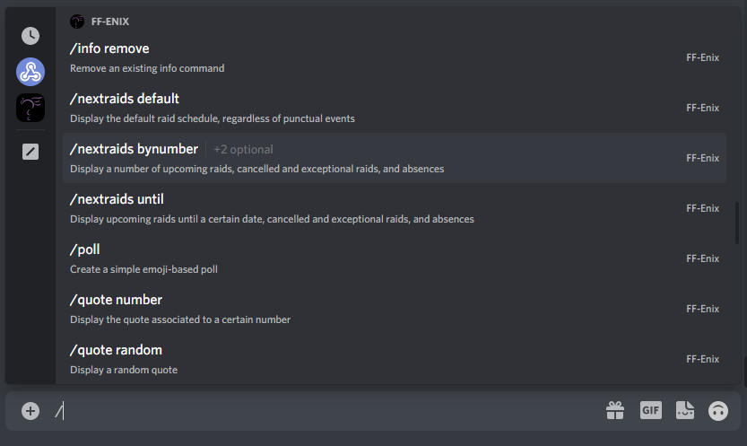

# FF-Enix bot

A Discord bot for the FF-Enix discord server.

Below is a list of all the current bot's features. Click on any of the features for a more detailed documentation.

| Feature | Commands | Description | Related role |
|:---:|:---:|---|:---:|
| [Scheduling](src/main/kotlin/bot/features/scheduling/SchedulingDocumentation.md)  | `/nextraids` `/schedule` `/timezones` | Display and manage the raid schedule. | Scheduler
| [Guides](src/main/kotlin/bot/features/guides/GuidesDocumentation.md) | `/guides` `/editguides` | Display and manage guides. | Strategist
| [Info commands](src/main/kotlin/bot/features/info/InfoDocumentation.md)  | `/info` | Manage custom info commands. | Herald
| [Quotes](src/main/kotlin/bot/features/quotes/QuotesDocumentation.md) | `/quote` `/editquote` | Display and manage quotes. | Archivist
| [Poll](src/main/kotlin/bot/features/poll/PollDocumentation.md) |`/poll`  | Create a simple emoji-based poll. | /
| [Bonk](src/main/kotlin/bot/features/bonk/BonkDocumentation.md)  | `/bonk` `/hornyjail` | Bonk users and check out their bonk scores. | /
| [Speech](src/main/kotlin/bot/features/speech/SpeechDocumentation.md) | `/uwu` | Have the bot talk like a real cutie. | /

## How to use the bot's commands

Simply type `/` in any channel's chat to bring up all slash commands for the server!  
Discord will display every available command and subcommand, as well as a description. When you start writing, Discord
will guide you through the different options.

If a command is greyed out, it means you do not have the necessary role to use it. Refer to the documentation to know
which role grants access to which commands!

***

## Technical notes

- This bot relies on the [Kord](https://github.com/kordlib/kord) library, which is a Kotlin implementation of
  the [Discord API](https://discord.com/developers/docs/intro).
- The present application is hosted on [Heroku](https://www.heroku.com/home).
- All persistent data is saved on [Dropbox](https://www.dropbox.com/home) and accessed through
  the [Dropbox API](https://www.dropbox.com/developers) with the [Retrofit](https://square.github.io/retrofit/) library.

## Project structure

### The [bot](src/main/kotlin/bot) package

- The bot's functionality is split into [features](src/main/kotlin/bot/features). Each feature declares its own
  commands, responses to said commands, as well as its required data structure and roles.
- Some common functionality between all features, such as data and role management, is gathered in
  the [core](src/main/kotlin/bot/features/core) package.
- The [remote](src/main/kotlin/bot/remote) package contains everything related to the outer data layer, such as
  communication with the Dropbox API.
- The [FFEnixBot](src/main/kotlin/bot/FFEnixBot.kt) class represents the bot itself, which aggregates the aforementioned
  features.

### The [runtime](src/main/kotlin/runtime) package

[BotMain](src/main/kotlin/runtime/BotMain.kt) is the file that is executed when the bot is deployed. It uses environment
variables to access the bot's API key.

### The [examples](src/main/kotlin/examples) package

These examples show some simple usages of the Kord library.

### The [utils](src/main/kotlin/utils) package

Contains some useful functions, in particular a logging class and extension functions.

## Note on contributions

All contributions, suggestions and requests are welcome! Feel free to open an issue on GitHub directly, or send me a DM
on discord (@SnowHawkeye#4215).

***

## Future plans

### Implement new commands

A bot can have up to 100 slash commands per server! Some ideas for future commands include: 
- Info commands as embeds instead of simple text.
- A reminder command `/remind @thisPerson thatThing atThisDate`.
- A currency / gamble system.
- ... And any other idea you might have!

### Make use of [user commands](https://discord.com/developers/docs/interactions/application-commands#user-commands) and [message commands](https://discord.com/developers/docs/interactions/application-commands#message-commands)

Discord's API allows for commands that are available directly by right-clicking a user or a message. While these offer
interesting possibilities, I have had inexplicable issues using them that seemed to be either on Kord's or Discord's
side. Implementing them will require some more exploring and testing.

